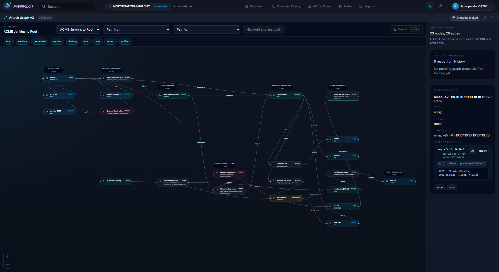
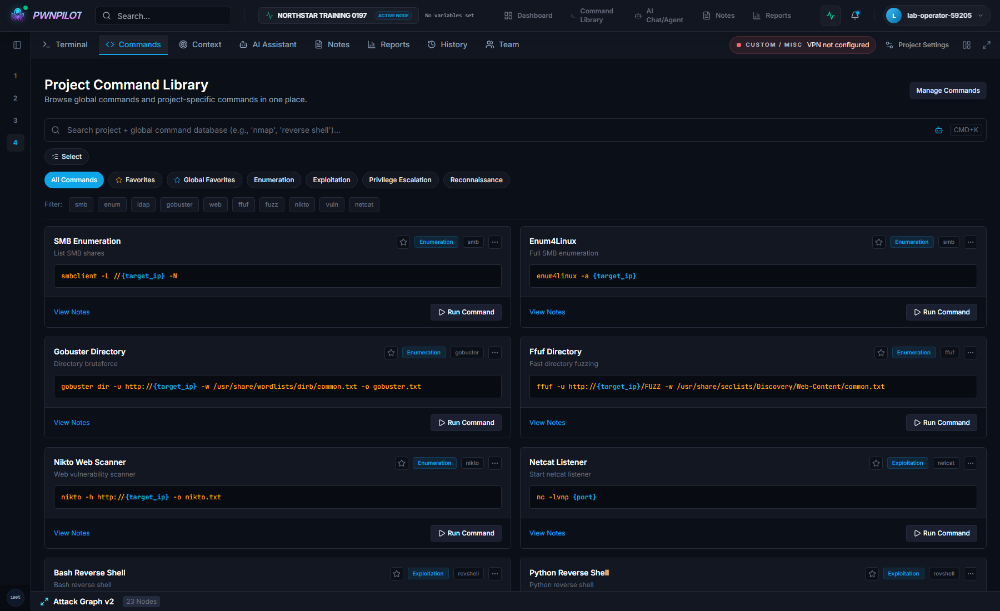
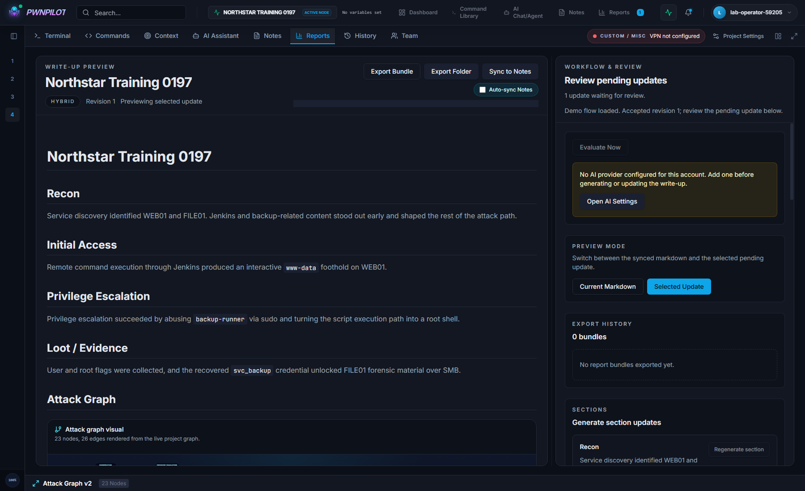
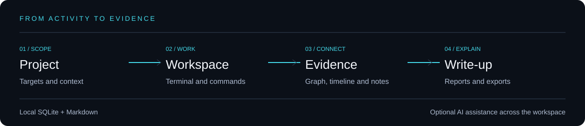

<p align="center"></p>
<h1 align="center">PwnPilot</h1>
<p align="center"><strong>Your pentest workspace, from first command to final write-up.</strong></p>
<p align="center">A local-first cockpit for security labs, CTFs, and authorized assessments.</p>

<p align="center">
  
  <a href="LICENSE"></a>
  
</p>
<p align="center"><a href="#presentation">Blog</a> · <a href="#features">Features</a> · <a href="#quick-start">Quick start</a> · <a href="#how-it-fits-together">Architecture</a> · <a href="#development">Development</a></p>

> [!IMPORTANT]
> **Development is currently paused due to a lack of time.** PwnPilot is shared as a work-in-progress project for others to explore, learn from, and build upon. Bugs and unfinished workflows remain.



PwnPilot brings the pieces of a security engagement into one browser workspace: a terminal, reusable commands, a timeline, Markdown notes, an attack graph, reports, and optional AI assistance. The aim is to keep the evidence and reasoning next to the work, instead of scattered across terminal windows and scratch files.

The application runs on your own machine. SQLite stores structured data; workspaces and Markdown files stay on disk. AI features are optional: configured remote providers receive the context you send them. Local-first does not mean every AI integration is offline.

### Command library

Keep reusable commands alongside your project and its target variables.



### Reports

Build a write-up from the project's collected context and evidence.



## Features

| Workspace | What is implemented |
| --- | --- |
| **Projects** | Separate engagement workspaces, target variables, project context, and a dashboard. |
| **Terminal** | Embedded sessions, command history, and handoffs to the AI assistant. Capabilities depend on the host and provider. |
| **Command library** | Searchable commands, categories, project commands, and variable substitution. |
| **Attack graph** | Hosts, services, credentials, evidence, paths, and reviewable proposals derived from activity. |
| **Timeline** | Commands, notes, findings, filters, and links to supporting knowledge. |
| **Markdown knowledge base** | Local vaults, full-text search, wikilinks, and an editor/viewer workflow. |
| **Reports** | Living write-ups, report proposals, evaluation workflows, and exports. |
| **AI assistance** | Configurable providers, prompt templates, project context, and API/CLI agent integrations. |
| **Collaboration** | Accounts, invitations, project membership, and access requests. |

These are implemented surfaces, not a promise that every integration is production-ready. See the [feature coverage matrix](docs/testing/feature-test-matrix.md) and [architecture notes](docs/ARCHITECTURE.md).

## Quick start

### Prerequisites

- **Python 3.11+**, with `venv` and `pip`.
- **Node.js 20.19+ or 22.12+**, with npm.
- **Git** and a current desktop browser.
- On Linux/Kali, **tmux** and **ttyd** for the preferred terminal provider. Windows uses the `legacy` provider.

```bash
git clone https://github.com/Thunzyy/PwnPilot.git
cd PwnPilot
```

### Windows

```powershell
Copy-Item .env.example .env
powershell -ExecutionPolicy Bypass -File .\start.ps1
```

### Linux / Kali

```bash
cp .env.example .env
bash ./start.sh
```

The launchers prepare the backend environment, install dependencies, apply database migrations, and start both services.

| Service | Default address |
| --- | --- |
| Application | [localhost:5173](http://localhost:5173) |
| Backend | [localhost:8001](http://localhost:8001) |
| API documentation | [localhost:8001/docs](http://localhost:8001/docs) |

The example configuration seeds an **`admin` / `admin`** demonstration account and a CTF project. Use it only on your own machine. For a fresh personal setup, set `SEED_ADMIN_ENABLED=false` before the first launch and sign up through the UI. Set a unique `JWT_SECRET` in your local `.env`; generate one with `python -c "import secrets; print(secrets.token_urlsafe(48))"`.

### Configuration

Edit the root `.env`; do not commit it. See [`.env.example`](.env.example) for defaults.

| Setting | Purpose |
| --- | --- |
| `BACKEND_PORT` / `FRONTEND_PORT` | Change the default local ports. |
| `BACKEND_HOST` / `FRONTEND_HOST` | Bind addresses; keep `127.0.0.1` for local use. |
| `PROJECTS_ROOT` | Where project workspaces are stored. |
| `WINDOWS_CONSOLE_PROVIDER` | Defaults to `legacy`. |
| `LINUX_CONSOLE_PROVIDER` | Defaults to `tmux_ttyd`. |
| `ATTACK_GRAPH_AUTO_SEED_DEMO` | Enable the built-in example graph for CTF projects. |
| `SEED_ADMIN_ENABLED` | Enable or disable the example account on startup. |
| `AUTO_STOP_PORT_LISTENERS` | Defaults to `false`; occupied ports are not automatically reclaimed. |

Use PwnPilot only with systems you own or are authorized to assess. This prototype can execute commands on its host and is intended for a trusted local environment, not direct exposure to the public internet.

## How it fits together



| Layer | Technology |
| --- | --- |
| Browser UI | React 19, TypeScript, Vite, Zustand, TanStack Query |
| Terminal, editor, graph | Xterm.js, CodeMirror, React Flow |
| Backend | Python, FastAPI, async SQLAlchemy, Alembic |
| Storage | SQLite with FTS5, local files and Markdown |
| Optional integrations | AI API/CLI providers, MCP, community knowledge sources |

Community sources such as GTFOBins, HackTricks Cloud, and OWASP retain their own licenses. They are optional knowledge imports, not original PwnPilot content.

## Development

After startup has installed application dependencies, install backend development dependencies with the backend virtual environment's Python:

```powershell
# Windows, from the repository root
.\backend\.venv\Scripts\python.exe -m pip install -r backend/requirements-dev.txt
cd frontend
npm run test:e2e:install
cd ..
powershell -ExecutionPolicy Bypass -File .\scripts\check.ps1
```

```bash
# Linux / Kali, from the repository root
backend/.venv/bin/python -m pip install -r backend/requirements-dev.txt
(cd frontend && npm run test:e2e:install)
bash ./scripts/check.sh
```

The gate runs backend lint, migrations, pytest, an import check, frontend lint, a production build, Vitest, and Playwright browser tests. Use a disposable development database: the migration step uses the configured database.

## Repository map

| Path | Contents |
| --- | --- |
| `backend/app/` | API routes, services, models, providers, and settings. |
| `backend/alembic/` | Database migrations. |
| `backend/tests/` | Backend regression and integration tests. |
| `frontend/src/` | Browser application, graph, terminal, editor, and project views. |
| `frontend/e2e/` | Playwright browser scenarios. |
| `scripts/` | Verification and development utilities. |
| `docs/` | Architecture, test notes, blog articles, and screenshots. |
| `assets/` | README branding and workflow illustration. |

## Documentation

- [Architecture overview](docs/ARCHITECTURE.md)
- [Architecture diagrams](docs/architecture/README.md)
- [Feature coverage](docs/testing/feature-test-matrix.md)

## Contributions and status

Forks, experiments, and contributions are welcome.

## License

[MIT](LICENSE) — Copyright (c) 2026 Lucas Poignard.
