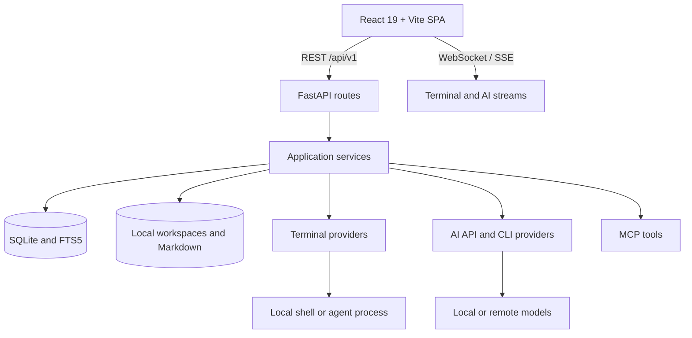
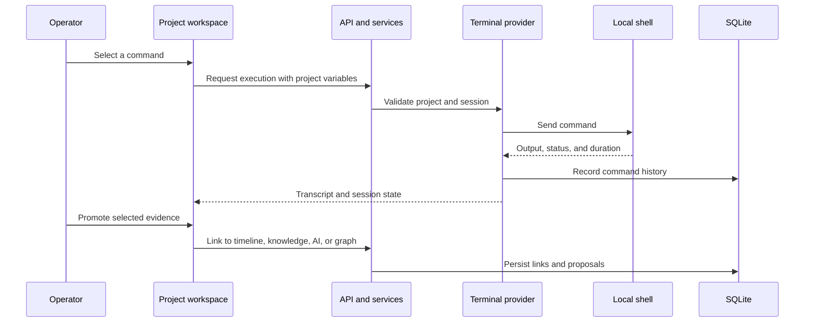
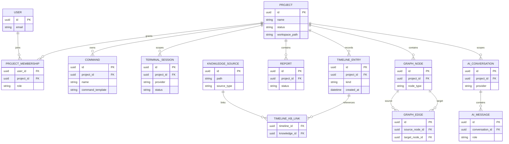

# PwnPilot architecture

PwnPilot is a local-first pentest and CTF workspace. It combines projects, target variables, commands, an embedded terminal, a timeline, Markdown knowledge sources, engagement graphs, reports, and optional AI assistance. Development is paused; this document describes the implemented structure rather than a release commitment.

## System boundaries

The backend is a modular monolith. Routes handle transport and authorization; services coordinate application behavior; SQLAlchemy models and Alembic migrations manage persistence. The browser uses Zustand and TanStack Query for state and caching. A compatibility `/api` router remains alongside `/api/v1`.

## Components

| Component | Source | Responsibility |
| --- | --- | --- |
| Browser application | `frontend/src/pages/`, `components/` | Project views, terminal, knowledge, reports, and AI UI. |
| Client state | `frontend/src/stores/`, `hooks/`, `lib/queryClient.ts` | UI preferences, server caching, and view coordination. |
| API | `backend/app/main.py`, `routers/` | REST, WebSocket routing, health checks, startup, and shutdown. |
| Services | `backend/app/services/` | Project, terminal, AI, knowledge, reporting, and graph behavior. |
| Persistence | `backend/app/models/`, `backend/alembic/` | Relational models and schema migrations. |
| AI and agents | `backend/app/services/ai*`, `services/agent/` | Providers, context, chat, attachments, and CLI processes. |
| Prompt catalog | `backend/data/prompts/` | Bundled system prompts and reusable templates. |
| Knowledge base | `backend/app/models/knowledge.py`, `frontend/src/pages/KnowledgeBase.tsx` | Markdown sources, indexing, search, wikilinks, and bookmarks. |
| Reporting | `backend/app/models/report.py`, `frontend/src/pages/Reports.tsx` | Sections, update proposals, evidence, and exports. |
| Attack graph | `backend/app/models/graph.py`, `frontend/src/features/attack-graph/` | Typed nodes, edges, scenarios, proposals, and graph views. |

## Command and evidence flow

## Stored data

- Identity: users, refresh tokens, project memberships, and access requests.
- Projects: type, status, variables, workspace paths, and project settings.
- Commands: global/project libraries, categories, favorites, and execution history.
- Evidence: timeline entries, knowledge links, graph proposals, and report evidence links.
- Knowledge: source records, indexed documents, frontmatter, tags, bookmarks, and full-text indexes.
- AI: provider configurations, context routing, prompts, presets, conversations, messages, CLI sessions, memories, and attachments.
- Runtime: terminal sessions, viewers, and agent process metadata used for recovery.
- Reports: one report per project, sections, revisions, proposed updates, and export artifacts.
- Graphs: nodes, edges, scenarios, positions, and derived engagement state.

SQLite stores structured data. Markdown, attachments, and project files stay on disk. Some settings and derived state use JSON columns. Do not remove migrations or compatibility endpoints solely because they are absent from the current UI: existing databases and clients may depend on them.

The following is a logical model inferred from the SQLAlchemy models and Alembic migrations; it is not a replacement for an exported production schema.

## Configuration and execution

Copy the root `.env.example` to `.env`, then run `start.ps1` on Windows or `bash start.sh` on Linux/Kali. The default application and API ports are 5173 and 8001. The launchers set `VITE_API_URL` and apply migrations before starting services. Configuration details are in the [README](../README.md#configuration).

Windows defaults to the `legacy` terminal provider. Linux/Kali uses `tmux_ttyd` when available. Provider capability responses let the UI distinguish available, degraded, and unavailable sessions.

## Trust boundaries

PwnPilot can start local processes and read configured workspaces. It is intended for a trusted local environment. Local-first storage does not imply offline AI: remote providers receive selected context. Keep credentials, databases, account files, and local configuration outside Git. Community knowledge imports retain their upstream licenses.

## Validation and follow-up

Use [verification scripts](../README.md#development), the [feature coverage matrix](testing/feature-test-matrix.md), and [browser smoke scenarios](testing/browser-smoke.md). Native Linux/Kali terminal behavior and live AI provider behavior require their own environment-specific checks.

The [diagram index](architecture/README.md) provides focused views. Development is paused. PostgreSQL, Redis, and a microservice split are not requirements of the current local-first architecture.
