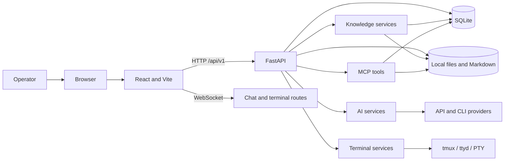

# System overview

The browser runs a single-page application. The local backend owns API contracts, WebSocket connections, SQLite persistence, and filesystem access. Platform-specific capabilities are isolated behind services and terminal providers. Remote AI providers are optional and receive the context sent to them.
