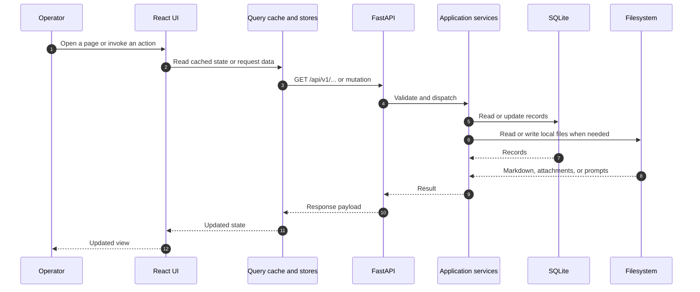

# Frontend, backend, and data flow

Client caches support fast reads; the backend remains the source of truth. Writes go through API routes and services. Project files remain on disk where filesystem storage is more appropriate than relational records.
