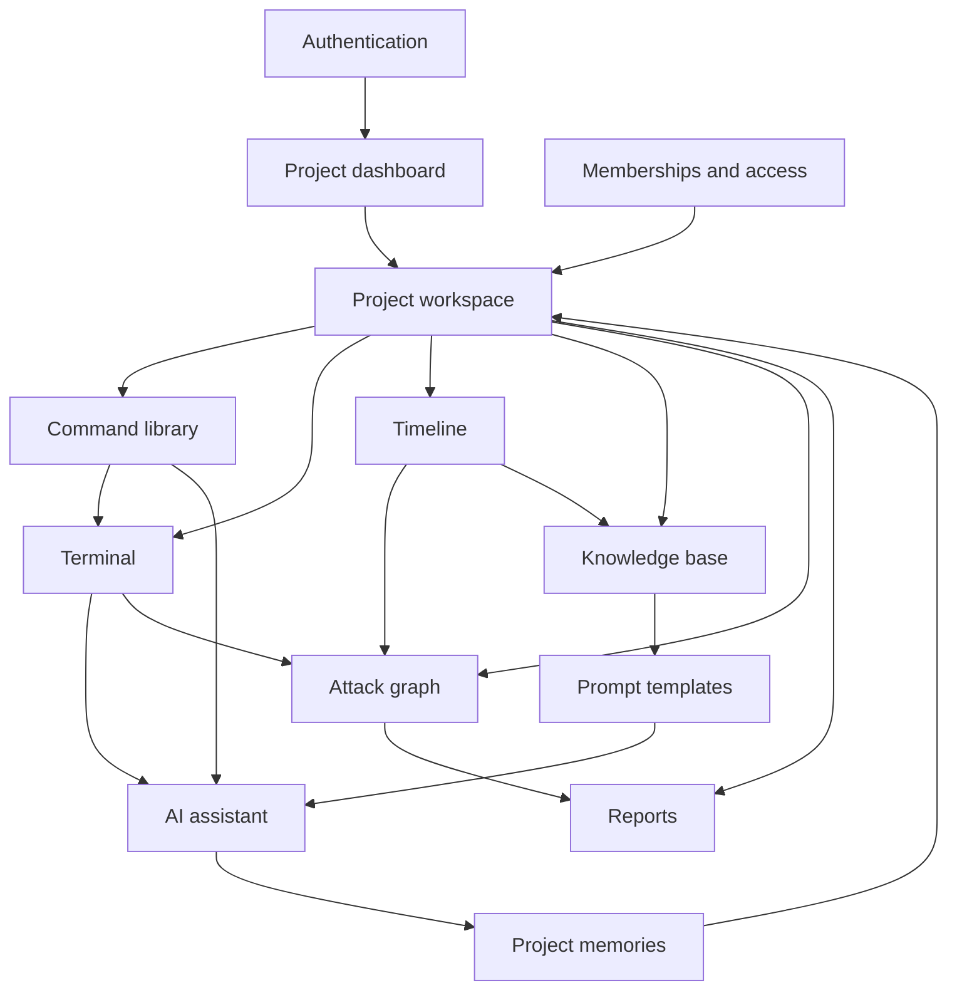

# Feature domains

The project workspace connects operational views. The terminal, knowledge base, and timeline provide evidence and context. AI consumes project context and selected material; report workflows turn recorded evidence into reviewable write-ups.
