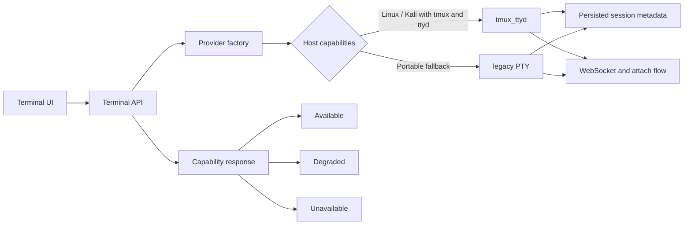

# Cross-platform terminal

Provider selection must reflect actual host support. Windows defaults to `legacy`; Linux/Kali prefers `tmux_ttyd` when its dependencies are installed. An explicit degraded or unavailable state is preferable to a silent failure.

Cross-platform browser tests do not establish native tmux/ttyd behavior. Use the [Linux/Kali protocol](../testing/terminal-native-smoke.md) to verify detach, multiple viewers, transcripts, and AI handoffs on that platform.
