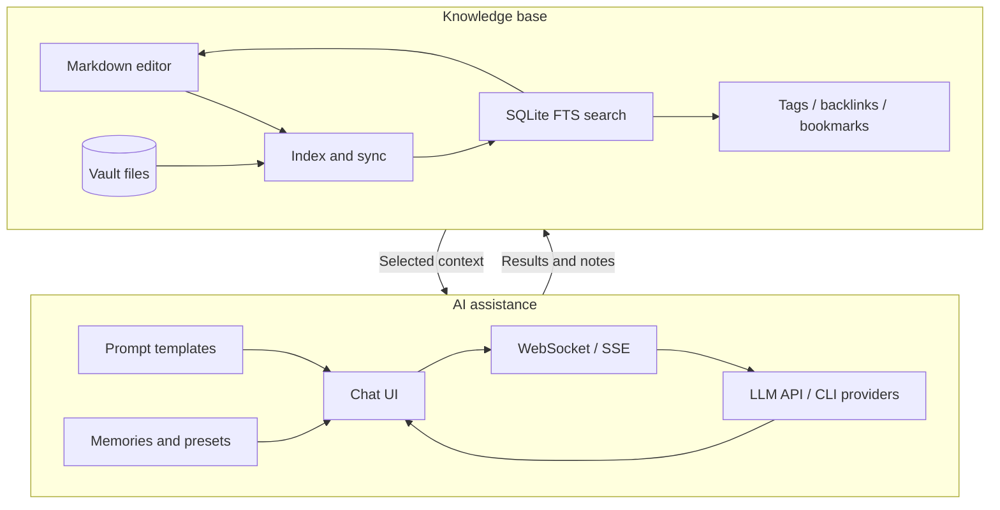

# AI and knowledge base

Knowledge sources provide navigation and full-text search as well as editing. AI can use project context, selected documents, prompts, and memories. The configured provider determines whether processing happens locally or through a remote service. Provider credentials and runtime settings belong in local configuration, not in repository examples.
