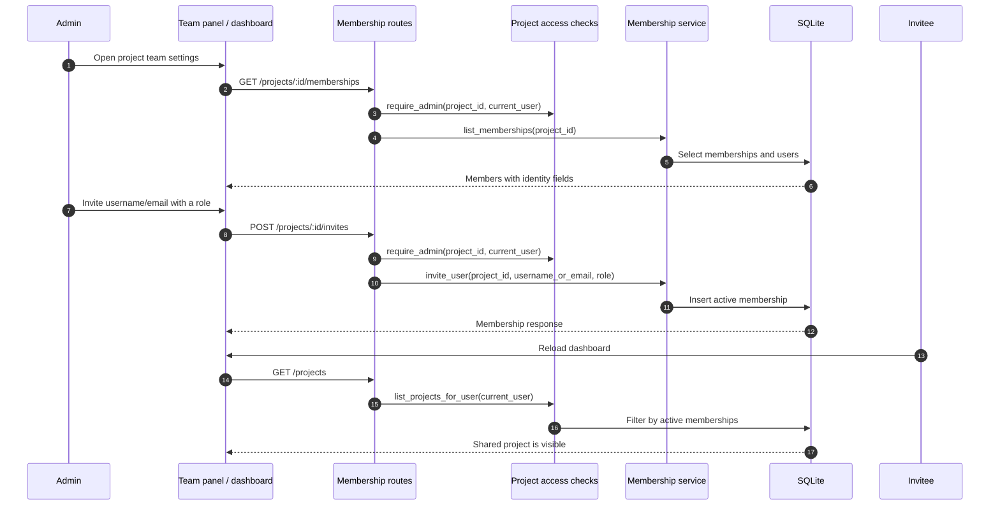

# Collaboration and project access

The team panel displays readable identity fields while preserving user IDs. Membership administration is restricted to project administrators. Dashboard visibility depends on active memberships. Separate access-request flows allow an administrator to approve or reject an outsider's request; see the [collaboration feature](../features/collaboration.md).
