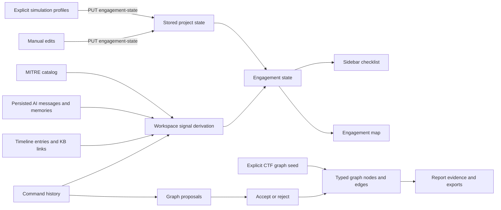

# Engagement maps and simulation

PwnPilot contains an engagement-state contract and a separate typed attack-graph API. Keep these contracts distinct when tracing data or changing a view.

When no stored engagement state exists, derivation uses command history, timeline/knowledge links, and persisted AI signals. Tool patterns and MITRE technique metadata inform phases and layout. Timeline and AI nodes retain explicit provenance labels so they are not mistaken for shell execution.

Manual engagement edits and the web, AD, pivoting, and cloud simulation profiles use the same engagement-state contract as the checklist. The typed graph has its own nodes, edges, scenarios, proposals, and position persistence. Its built-in CTF seed creates synthetic evidence; it does not execute the example attack commands. See the [engagement feature](../features/engagement-map.md) and [browser smoke tests](../testing/browser-smoke.md).
