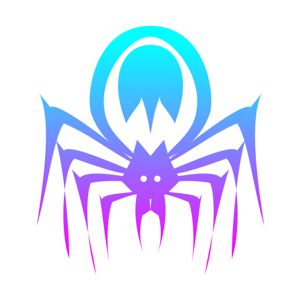
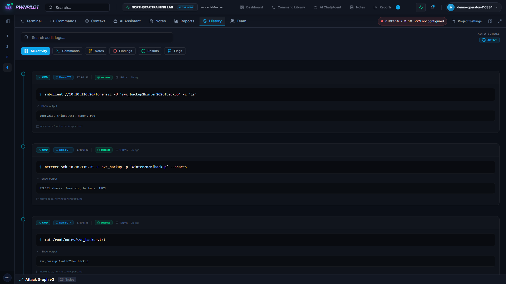
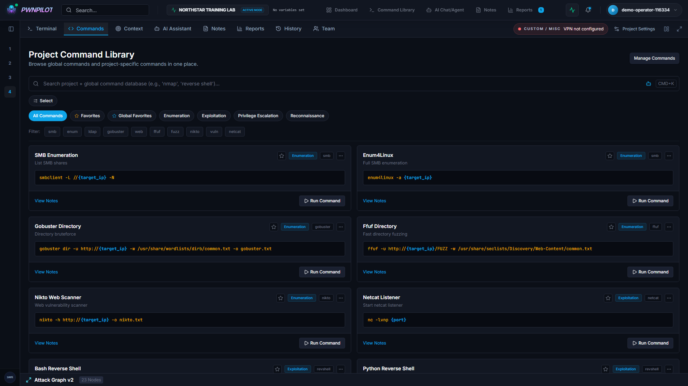
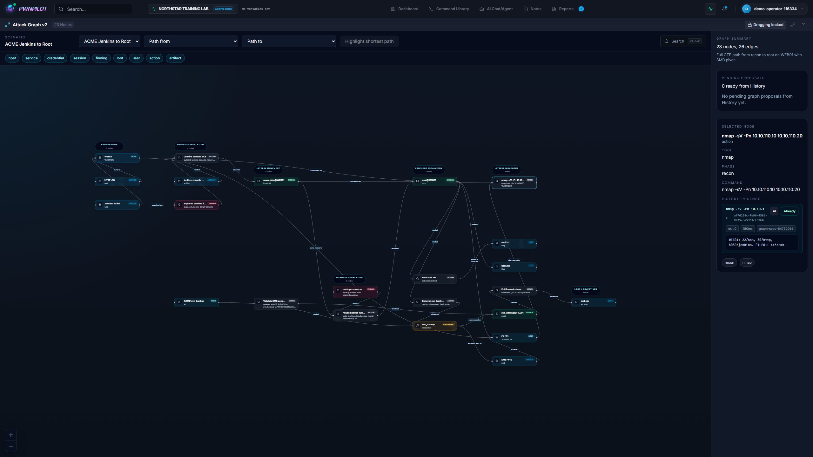
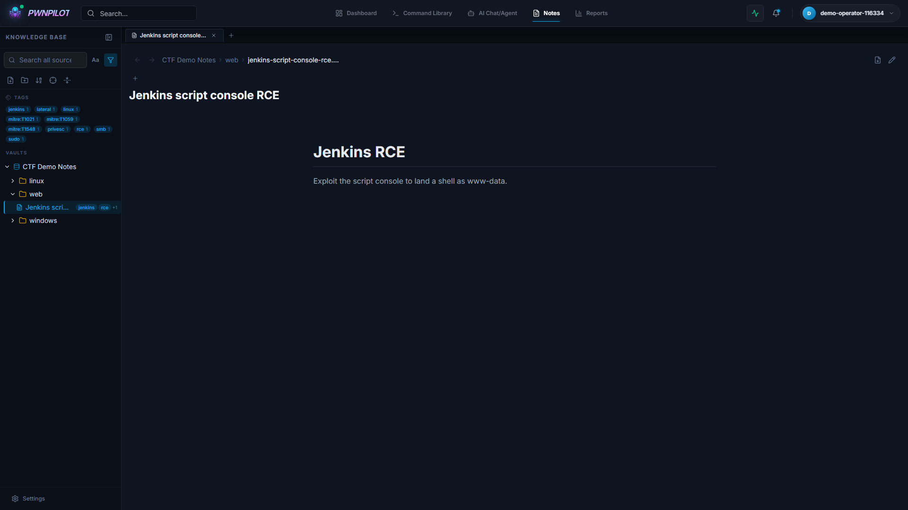
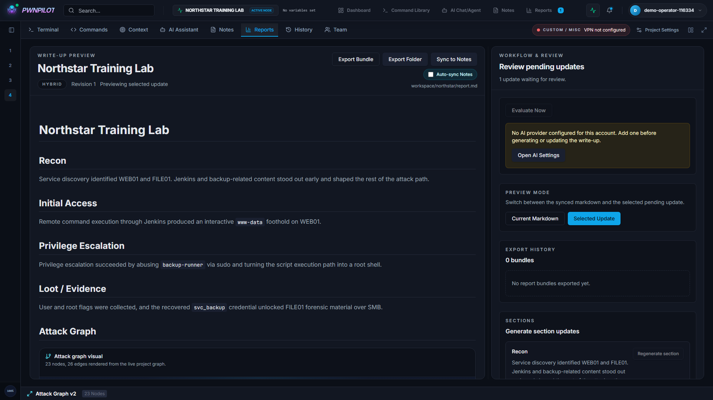
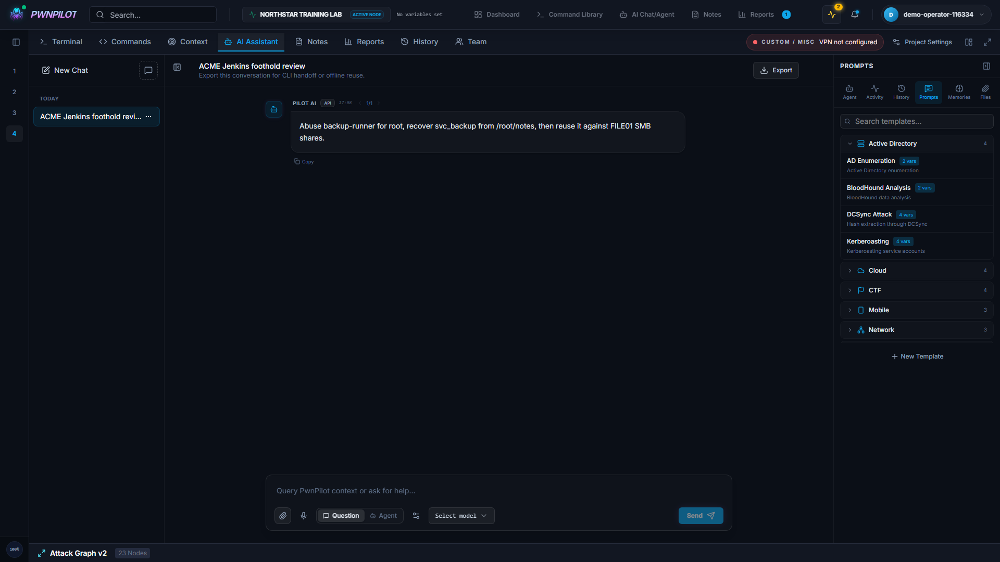

<h1 align="center">PwnPilot</h1>

Un cockpit local pour relier commandes, preuves et rapport

<a href="https://github.com/Thunzyy/PwnPilot">GitHub</a> · <a href="#parcours">Parcours</a> · <a href="#stack">Architecture</a>

> **En bref** : PwnPilot rassemble terminal, bibliothèque de commandes, historique, notes Markdown, graphe et rapport dans un espace de projet. Les fonctions IA sont optionnelles. Le développement est actuellement en pause par manque de temps.

---

## Sommaire

- [Pourquoi ce projet](#origine)
- [Du projet au rapport](#parcours)
- [Garder le fil de la session](#historique)
- [Des commandes réutilisables](#commandes)
- [Un graphe pour relier les preuves](#graphe)
- [Des notes Markdown proches du travail](#notes)
- [Un rapport qui se construit progressivement](#rapport)
- [Une assistance IA optionnelle](#ia)
- [Comment l’application est construite](#stack)
- [État du projet](#etat)

---

## Pourquoi ce projet

Une session de pentest ou de CTF produit beaucoup plus que des commandes. Il y a les cibles, les hypothèses, les sorties de terminal, les notes, les identifiants de laboratoire et les morceaux du futur rapport. Quand tout cela est réparti entre plusieurs fenêtres et fichiers, retrouver le raisonnement devient une tâche à part entière.

PwnPilot part de cette difficulté : garder le travail et son contexte dans le même espace. Une commande doit pouvoir être reliée à sa sortie, à une note et à une étape du parcours. Le rapport peut alors se construire pendant la session plutôt qu'à partir de souvenirs, une fois le terminal fermé.

L'application ne remplace pas les outils de sécurité. Elle rassemble les éléments qui permettent de comprendre ce qu'ils ont produit.

---

## Du projet au rapport

Le parcours tient en quatre étapes :

1. **Créer un projet** et définir son contexte, ses cibles et ses variables.
2. **Travailler dans le terminal** ou préparer une commande depuis la bibliothèque.
3. **Conserver les preuves** dans l'historique, les notes et le graphe.
4. **Construire le rapport** en examinant les mises à jour proposées.

---

## Garder le fil de la session

L'historique rapproche les commandes et les entrées de timeline. Il devient possible de revoir une sortie, retrouver une étape ou ajouter une note au même endroit. Le projet fournit le contexte qui manque souvent à un simple historique de shell.

Le terminal intégré utilise le shell et les outils disponibles sur la machine hôte. PwnPilot n'embarque pas une distribution Kali et n'installe pas automatiquement tous les programmes présents dans les exemples. Le comportement des sessions dépend également du système et du fournisseur de terminal.

---

## Des commandes réutilisables

La bibliothèque classe les commandes par catégories et permet de les retrouver sans repartir d'une page blanche. Les variables du projet servent à adapter les modèles au contexte courant : une cible ou un chemin peut changer sans réécrire chaque commande.

Cela reste un outil de préparation. Une commande doit être comprise, adaptée au périmètre autorisé et vérifiée avant son exécution. La présence d'un modèle dans la bibliothèque ne valide ni ses paramètres ni son adéquation à la situation.

---

## Un graphe pour relier les preuves

Un graphe peut représenter les hôtes, les services, les actions, les sessions, les découvertes et les artefacts. Il permet de suivre un parcours et de revenir aux éléments qui le soutiennent, au lieu de n'en conserver qu'une description linéaire.

---

## Des notes Markdown proches du travail

La base de connaissances s'appuie sur des sources Markdown locales. Elle propose un arbre de documents, une recherche et des tags pour retrouver une technique ou une note. Les documents peuvent aussi être reliés aux éléments de la session.

L'intérêt est de garder les notes dans un format qui reste utilisable ailleurs. Un vault existant peut servir de source ; les modes de lecture et d'édition dépendent des permissions de cette source. Les captures montrent uniquement les notes du laboratoire synthétique.

---

## Un rapport qui se construit progressivement

Le rapport rassemble les étapes et les preuves dans une prévisualisation Markdown. Des mises à jour peuvent être proposées pour une section, avec un aperçu et un diff à examiner. Le flux d'export permet de récupérer le résultat et ses artefacts.

Cette approche rapproche la rédaction de la collecte. Elle n'enlève pas le travail de relecture : une conclusion, une chronologie et une recommandation doivent être validées par la personne qui conduit l'évaluation. Dans la démonstration, le contenu du rapport et ses propositions proviennent du scénario préchargé.

---

## Une assistance IA optionnelle

PwnPilot peut utiliser des fournisseurs de modèles via API, des modèles locaux et des intégrations CLI. L'assistant dispose de points d'entrée vers le contexte du projet et d'une bibliothèque de prompts. L'application fournit actuellement **48 prompts**, entre instructions système et modèles réutilisables.

Ces fonctions sont facultatives. L'historique, les notes et l'organisation du projet ne nécessitent pas un abonnement à un fournisseur de modèles. En revanche, un fournisseur distant reçoit le contexte qui lui est transmis : *local-first* ne signifie pas que toutes les intégrations sont hors ligne.

La conversation visible dans les captures est un exemple préchargé. Aucune réponse d'un modèle externe n'a été sollicitée pour produire ces médias. Les suggestions doivent être confrontées aux preuves et aux règles de l'engagement.

---

## Comment l’application est construite

| Couche | Choix | Rôle |
| --- | --- | --- |
| Interface | React, TypeScript, Vite | Vues de projet, terminal, notes, graphe et rapport |
| Backend | FastAPI, Python | API, autorisations et services applicatifs |
| Données | SQLite, SQLAlchemy, Alembic | Stockage structuré et migrations |
| Fichiers | Workspaces locaux, Markdown | Notes, rapports et artefacts |
| Temps réel | WebSocket, SSE | Terminal et échanges en streaming |
| Extensions | Fournisseurs IA, CLI, MCP | Intégrations configurables |

Le backend est un monolithe modulaire. Les routes traitent les échanges avec l'interface ; les services coordonnent les fonctions ; les modèles et migrations gèrent la persistance. Ce choix convient à une application qui démarre sur une machine et conserve ses données localement.

Les fonctions de collaboration ajoutent des comptes, des invitations et des droits de projet. Elles ne transforment pas le lancement local en service hébergé prêt à être exposé sur Internet.

---

## État du projet

**Le développement est en pause par manque de temps.** PwnPilot reste un projet en cours : certaines intégrations dépendent de l'environnement, des workflows restent à améliorer et des bugs peuvent subsister.

Vous etes les bienvenus pour forker, expérimenter et contribuer.

---

[Code source](https://github.com/Thunzyy/PwnPilot) · [Licence MIT](https://github.com/Thunzyy/PwnPilot/blob/main/LICENSE)
